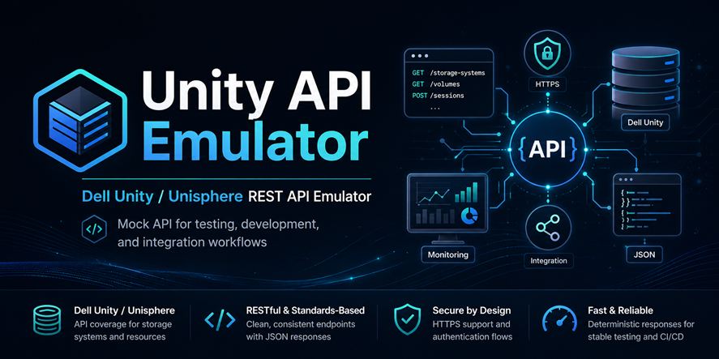

# Dell Unity / Unisphere REST API Emulator

> 

A Python-based Dell Unity / Unisphere REST API emulator for lab, development, and integration testing when a licensed Dell UnityVSA appliance is not available.

This project was created after the Dell UnityVSA Community Edition activation page became unavailable. Dell support resources advised that there was no ETA for a fix, which meant a deployed UnityVSA appliance could not be activated and the authenticated REST API could not be used for testing. This emulator provides a local Unity-style REST endpoint so API clients, scripts, integrations, and management-pack workflows can continue to be developed and validated without waiting for a working UnityVSA licence file.

The emulator is useful for testing:

- Generic Dell Unity / Unisphere REST API client logic.
- Authentication and session handling.
- `curl`, PowerShell, Python, and other REST API test workflows.
- VMware Aria Operations Management Pack Builder source and collection logic.
- Object discovery, field selection, filtering, ordering, pagination, and nested references.
- Mock action `POST` flows, asynchronous job responses, uploads/downloads, and metric query handling.

> **Important**  
> This is a mock API server. It is not a Dell product, it does not implement real storage behaviour, and it must not be used to validate destructive operations, production automation safety, or operational runbooks against real Dell Unity arrays.

---

## Why this exists

The Dell UnityVSA Community Edition is normally a useful way to test Unisphere and Dell Unity REST API integrations in a lab. However, when the Community Edition activation service is unavailable, the virtual appliance may deploy successfully but remain effectively unusable for authenticated API testing.

This emulator was created to provide a practical workaround for that situation. It gives developers and infrastructure engineers a predictable local REST endpoint that behaves enough like the Unity / Unisphere API to test request construction, authentication flows, response parsing, collection logic, error handling, and integration behaviour.

It was initially built while testing VMware Aria Operations Management Pack Builder workflows, but it is not limited to MPB. It can also be used for general REST API experimentation, script development, demo environments, CI-style parser tests, and client-side validation where a real Dell Unity system is not available.

---

## What this emulator does

The emulator provides Unity-style API routes such as:

```text
/api
/api/types
/api/types/<resource>/instances
/api/instances/<resource>/<id>
/api/types/<resource>/action/<action>
/api/instances/<resource>/<id>/action/<action>
```

It returns JSON response structures modelled around common Unity API patterns, including:

- `entries` collections.
- `content` objects.
- `links` arrays.
- `@base` and `updated` fields.
- Unity-style health objects.
- Mock references to related resources.
- Mock error responses.
- Mock job objects for async-style operations.

The goal is not perfect schema parity with every Dell Unity endpoint. The goal is to provide a realistic enough API surface to allow client-side development and integration testing to continue when a real licensed UnityVSA or physical Unity appliance is unavailable.

---

## Features

- HTTPS enabled by default.
- Automatic self-signed certificate generation.
- Option to use a provided certificate and private key.
- Optional plain HTTP mode for legacy local testing.
- Unity-style Basic authentication.
- Required `X-EMC-REST-CLIENT: true` header for authenticated requests.
- Mock session cookies:
  - `mod_sec_emc`
  - `TGC`
- Mock CSRF token support:
  - `EMC-CSRF-TOKEN`
- Compatibility behaviour for tools that authenticate once and then perform follow-up `GET` requests.
- Optional strict authentication mode.
- Optional strict field validation.
- Optional strict operation validation.
- Seeded mock data for common Unity resources, including:
  - `system`
  - `basicSystemInfo`
  - `storageProcessor`
  - `pool`
  - `disk`
  - `lun`
  - `filesystem`
  - `storageResource`
  - `nasServer`
  - `host`
  - `ethernetPort`
  - `ipInterface`
  - `iscsiNode`
  - `iscsiPortal`
  - `alert`
  - `event`
  - `remoteSystem`
  - `replicationSession`
  - `metric`
  - `metricQueryResult`
  - `job`
- Generic object generation for broader resource catalogue browsing.
- Support for common query options:
  - `fields`
  - `compact`
  - `filter`
  - `orderby`
  - `groupby`
  - `page`
  - `per_page`
  - `with_entrycount`
- Mock support for selected actions such as:
  - `ping`
  - `traceroute`
  - `verify`
  - `validate`
  - `test`
  - `recommendForInterface`
  - `recommendForAggregation`
  - `retrieveNonce`
  - `getAces`
  - `listAvailableDisks`

---

## Requirements

### Required

- Python 3.9 or later is recommended.
- No mandatory third-party Python modules are required for normal operation.

### Optional

For automatic self-signed certificate generation, the emulator will try to use:

1. The `openssl` executable, if available.
2. The Python `cryptography` package as a fallback.

If neither is available, provide your own certificate and private key using `--ssl-cert` and `--ssl-key`.

Optional fallback install:

```bash
pip install cryptography
```

---

## Quick start

### 1. Clone the repository

```bash
git clone https://github.com/mackayd/Unity-API-Emulator.git
cd Unity-API-Emulator
```

### 2. Start the emulator with HTTPS

```bash
python Unity_RestAPI_Emulator.py --host 0.0.0.0 --port 8443
```

By default, HTTPS is enabled. If no certificate is supplied, the emulator generates or reuses a self-signed certificate under:

```text
./unity_mock_certs/
```

The console output shows:

- Listening URL.
- Certificate path.
- Private key path.
- Certificate SHA256 fingerprint.
- DNS and IP Subject Alternative Names.
- Default credentials.
- Useful `curl` probes.

### 3. Test the unauthenticated basic system endpoint

```bash
curl -k "https://127.0.0.1:8443/api/types/basicSystemInfo/instances"
```

### 4. Test an authenticated Unity-style query

```bash
curl -k \
  -u "admin:Password123!" \
  -H "X-EMC-REST-CLIENT: true" \
  "https://127.0.0.1:8443/api/types/system/instances?fields=id,name,model,serialNumber,softwareVersion,health&compact=true"
```

### 5. Query storage resources

```bash
curl -k \
  -u "admin:Password123!" \
  -H "X-EMC-REST-CLIENT: true" \
  "https://127.0.0.1:8443/api/types/storageResource/instances?fields=id,name,type,sizeTotal,pool.name,health&compact=true"
```

---

## Default credentials

```text
Username: admin
Password: Password123!
```

The default credentials can be changed at startup:

```bash
python Unity_RestAPI_Emulator.py \
  --host 0.0.0.0 \
  --port 8443 \
  --username apiuser \
  --password "ChangeMe123!"
```

---

## Running modes

### HTTPS with generated self-signed certificate

```bash
python Unity_RestAPI_Emulator.py --host 0.0.0.0 --port 8443
```

### HTTPS with a provided certificate and key

```bash
python Unity_RestAPI_Emulator.py \
  --host 0.0.0.0 \
  --port 8443 \
  --ssl-cert unity.crt \
  --ssl-key unity.key
```

### Plain HTTP mode

```bash
python Unity_RestAPI_Emulator.py --http --host 0.0.0.0 --port 8080
```

Plain HTTP mode is useful for basic local testing, but HTTPS mode is recommended when testing tools that expect Unity-like secure endpoints.

---

## General REST API testing usage

You can use the emulator as a target for any tool that can send HTTP requests, including:

- `curl`
- Postman
- Bruno
- Insomnia
- PowerShell `Invoke-RestMethod`
- Python `requests`
- Custom SDKs or API wrappers
- CI jobs that validate JSON parsing or request construction

Typical test areas include:

- Does the client send the correct Unity-style headers?
- Does the client handle Basic authentication correctly?
- Does the client tolerate self-signed certificates in a lab?
- Does the client parse `entries[*].content` collection responses?
- Does the client handle nested references such as `pool.name` or `storageProcessor.name`?
- Does the client handle pagination and `with_entrycount=true`?
- Does the client handle 401, 403, 404, 405, and 422-style error responses?
- Does the client handle action responses and job-style async responses?

---

## VMware Aria Operations Management Pack Builder usage

The emulator was also designed to help test VMware Aria Operations Management Pack Builder source and collection behaviour.

When adding the emulator as a source in MPB, use settings similar to the following:

| Setting | Example value |
|---|---|
| Protocol | HTTPS |
| Hostname / IP | Emulator host IP or FQDN |
| Port | `8443` |
| Username | `admin` |
| Password | `Password123!` |
| Certificate handling | Trust/import the generated certificate, or disable certificate validation for mock testing if your lab policy allows it |

The emulator expects Unity-style authenticated requests to include:

```text
X-EMC-REST-CLIENT: true
```

The `basicSystemInfo` endpoint is intentionally available without authentication because Unity allows this endpoint to be queried before authenticated calls.

### MPB source update authentication behaviour

The emulator includes a compatibility behaviour for MPB source update testing. After a client IP successfully authenticates once, follow-up `GET` requests from that same client IP may be allowed without replaying Basic authentication or cookies. This helps with MPB workflows where credential validation and follow-up source update calls are not identical.

To force stricter Unity-style behaviour, start the emulator with:

```bash
python Unity_RestAPI_Emulator.py --host 0.0.0.0 --port 8443 --strict-auth
```

---

## Common API examples

### API root

```bash
curl -k "https://127.0.0.1:8443/api"
```

### List available resource types

```bash
curl -k \
  -u "admin:Password123!" \
  -H "X-EMC-REST-CLIENT: true" \
  "https://127.0.0.1:8443/api/types"
```

### Get system information

```bash
curl -k \
  -u "admin:Password123!" \
  -H "X-EMC-REST-CLIENT: true" \
  "https://127.0.0.1:8443/api/types/system/instances?fields=id,name,model,serialNumber,uuid,softwareVersion,health&compact=true"
```

### Get pools

```bash
curl -k \
  -u "admin:Password123!" \
  -H "X-EMC-REST-CLIENT: true" \
  "https://127.0.0.1:8443/api/types/pool/instances?fields=id,name,sizeTotal,sizeUsed,sizeFree,health&compact=true"
```

### Get disks with selected fields

```bash
curl -k \
  -u "admin:Password123!" \
  -H "X-EMC-REST-CLIENT: true" \
  "https://127.0.0.1:8443/api/types/disk/instances?fields=id,name,slotNumber,size,pool.name,health&compact=true"
```

### Get Ethernet ports

```bash
curl -k \
  -u "admin:Password123!" \
  -H "X-EMC-REST-CLIENT: true" \
  "https://127.0.0.1:8443/api/types/ethernetPort/instances?fields=id,name,storageProcessor.name,macAddress,currentSpeed,mtuSize,isLinkUp,health&compact=true"
```

### Filter results

```bash
curl -k \
  -u "admin:Password123!" \
  -H "X-EMC-REST-CLIENT: true" \
  "https://127.0.0.1:8443/api/types/pool/instances?filter=name eq 'Pool_01'&fields=id,name,sizeTotal,health&compact=true"
```

### Order results

```bash
curl -k \
  -u "admin:Password123!" \
  -H "X-EMC-REST-CLIENT: true" \
  "https://127.0.0.1:8443/api/types/storageResource/instances?orderby=name asc&fields=id,name,type,sizeTotal&compact=true"
```

### Use pagination

```bash
curl -k \
  -u "admin:Password123!" \
  -H "X-EMC-REST-CLIENT: true" \
  "https://127.0.0.1:8443/api/types/event/instances?per_page=1&page=1&with_entrycount=true"
```

### Run a mock action

```bash
curl -k \
  -u "admin:Password123!" \
  -H "X-EMC-REST-CLIENT: true" \
  -H "Content-Type: application/json" \
  -X POST \
  -d "{\"destination\":\"192.168.10.1\"}" \
  "https://127.0.0.1:8443/api/types/ipInterface/action/ping"
```

---

## PowerShell examples

### Basic authenticated request

```powershell
$pair = "admin:Password123!"
$encoded = [Convert]::ToBase64String([Text.Encoding]::ASCII.GetBytes($pair))

$headers = @{
    Authorization       = "Basic $encoded"
    "X-EMC-REST-CLIENT" = "true"
}

Invoke-RestMethod `
    -Uri "https://127.0.0.1:8443/api/types/system/instances?fields=id,name,model,serialNumber,health&compact=true" `
    -Headers $headers `
    -SkipCertificateCheck
```

### Query storage resources

```powershell
Invoke-RestMethod `
    -Uri "https://127.0.0.1:8443/api/types/storageResource/instances?fields=id,name,type,sizeTotal,pool.name,health&compact=true" `
    -Headers $headers `
    -SkipCertificateCheck
```

> `-SkipCertificateCheck` is available in PowerShell 7+. For Windows PowerShell 5.1, import the generated certificate into a trusted store or use your own trusted certificate.

---

## Python requests example

```python
import requests
from requests.auth import HTTPBasicAuth

url = "https://127.0.0.1:8443/api/types/system/instances"
params = {
    "fields": "id,name,model,serialNumber,softwareVersion,health",
    "compact": "true",
}
headers = {
    "X-EMC-REST-CLIENT": "true",
    "Accept": "application/json",
}

response = requests.get(
    url,
    params=params,
    headers=headers,
    auth=HTTPBasicAuth("admin", "Password123!"),
    verify=False,
    timeout=15,
)
response.raise_for_status()
print(response.json())
```

> `verify=False` is suitable only for quick local testing with the generated self-signed certificate. For cleaner lab testing, import the generated certificate or provide a certificate signed by a trusted CA.

---

## Command-line options

| Option | Default | Description |
|---|---:|---|
| `--host` | `0.0.0.0` | Listen address. |
| `--port` | `8080` | Listen port. Use `8443` or `443` for Unity-like HTTPS testing. |
| `--username` | `admin` | Basic authentication username. |
| `--password` | `Password123!` | Basic authentication password. |
| `--no-auth` | disabled | Disable Basic authentication and `X-EMC-REST-CLIENT` checks. |
| `--strict-auth` | disabled | Require Basic authentication or mock session cookies on every non-exempt request. |
| `--require-csrf` | disabled | Require `EMC-CSRF-TOKEN` on `POST` and `DELETE` requests. |
| `--strict-fields` | disabled | Return `422` when requested fields are not present in the mock object data. |
| `--strict-operations` | disabled | Return `405` for create, delete, or modify attempts on read-only resources. |
| `--quiet` | disabled | Suppress request logging. |
| `--http` | disabled | Run plain HTTP instead of HTTPS. |
| `--ssl-cert` | none | PEM certificate for HTTPS. Must be used with `--ssl-key`. |
| `--ssl-key` | none | PEM private key for HTTPS. Must be used with `--ssl-cert`. |
| `--cert-dir` | `./unity_mock_certs` | Directory for auto-generated certificate and key files. |
| `--cert-cn` | `unity-mock.local` | Common Name for the generated self-signed certificate. |
| `--cert-san` | none | Extra certificate Subject Alternative Name. Can be repeated or comma-separated. |
| `--cert-valid-days` | `825` | Validity period for the generated certificate. |
| `--regenerate-cert` | disabled | Regenerate the auto-generated certificate and key even if they already exist. |
| `--no-generate-cert` | disabled | Require `--ssl-cert` and `--ssl-key` instead of generating a certificate. |

---

## Certificate examples

### Add an IP address to the generated certificate SAN list

```bash
python Unity_RestAPI_Emulator.py \
  --host 0.0.0.0 \
  --port 8443 \
  --cert-san 192.168.50.100
```

### Add a DNS name to the generated certificate SAN list

```bash
python Unity_RestAPI_Emulator.py \
  --host 0.0.0.0 \
  --port 8443 \
  --cert-san DNS:unity-mock.lab.local
```

### Regenerate the certificate

```bash
python Unity_RestAPI_Emulator.py \
  --host 0.0.0.0 \
  --port 8443 \
  --regenerate-cert
```

---

## Authentication behaviour

The emulator implements the following simplified Unity-style authentication rules:

- `basicSystemInfo` is available without authentication.
- Authenticated API calls require:
  - HTTP Basic authentication.
  - `X-EMC-REST-CLIENT: true`.
- Successful authenticated responses include mock Unity session cookies.
- Optional CSRF enforcement can be enabled for `POST` and `DELETE` using `--require-csrf`.
- `--strict-auth` disables the follow-up request allowance.

---

## Strict testing modes

### Strict authentication

```bash
python Unity_RestAPI_Emulator.py --host 0.0.0.0 --port 8443 --strict-auth
```

Use this when you want every non-exempt request to include Basic authentication or mock session cookies.

### Strict field validation

```bash
python Unity_RestAPI_Emulator.py --host 0.0.0.0 --port 8443 --strict-fields
```

Use this when testing whether an API client is requesting fields that the mock object data does not currently expose.

### Strict operation validation

```bash
python Unity_RestAPI_Emulator.py --host 0.0.0.0 --port 8443 --strict-operations
```

Use this to return `405 Method Not Allowed` for create, delete, or modify attempts against read-only resource types.

### CSRF validation

```bash
python Unity_RestAPI_Emulator.py --host 0.0.0.0 --port 8443 --require-csrf
```

When enabled, `POST` and `DELETE` requests must include:

```text
EMC-CSRF-TOKEN: unity-mock-csrf-token
```

---

## Troubleshooting

### `401 Basic authentication header is required`

The request did not include Basic authentication, and the endpoint is not exempt.

Check that your request includes:

```text
Authorization: Basic <base64 username:password>
X-EMC-REST-CLIENT: true
```

With `curl`, use:

```bash
-u "admin:Password123!" -H "X-EMC-REST-CLIENT: true"
```

### `302 X-EMC-REST-CLIENT header is missing or not set to true`

Add the required Unity REST client header:

```text
X-EMC-REST-CLIENT: true
```

### `403 Invalid username or password`

The supplied credentials do not match the emulator startup values.

Use the defaults:

```text
admin / Password123!
```

Or start the emulator with explicit credentials:

```bash
python Unity_RestAPI_Emulator.py --username apiuser --password "ChangeMe123!"
```

### TLS or certificate validation errors

For local `curl` tests, use:

```bash
-k
```

For GUI/API tooling, either:

- import and trust the generated certificate,
- disable certificate validation for mock testing if your lab policy allows it, or
- provide a certificate signed by a trusted internal CA.

### Port already in use

Start the emulator on another port:

```bash
python Unity_RestAPI_Emulator.py --host 0.0.0.0 --port 9443
```

### A tool works for `basicSystemInfo` but fails on other endpoints

`basicSystemInfo` is intentionally unauthenticated. Most other endpoints require both Basic authentication and the `X-EMC-REST-CLIENT: true` header.

### MPB works for basic information but fails on source update

Try the default non-strict authentication mode first. If you enabled `--strict-auth`, remove it and retest. Some MPB workflows validate credentials on one request and then perform follow-up `GET` requests that may not replay Basic authentication in the same way.

---

## Limitations

- This emulator does not implement Dell Unity storage behaviour.
- It does not activate or replace Dell UnityVSA Community Edition.
- It does not validate real Dell Unity business logic.
- It does not provide exhaustive schema parity with Unisphere.
- It does not provide real capacity, performance, replication, file, block, or hardware state.
- Some fields are synthetic when strict field mode is disabled.
- Data is held in memory and is reset when the process restarts.
- It is intended for lab API testing, parser development, integration workflow testing, and demo use only.
- It should not be used to certify production automation, destructive actions, or operational runbooks.

---

## Security notes

- Do not expose this emulator to untrusted networks.
- Do not use real production credentials.
- Do not commit generated private keys or certificates to Git.
- Treat the default credentials as lab-only values.
- Use a firewall, host-only network, isolated lab network, or temporary test VLAN where possible.
- Prefer HTTPS mode when testing tools that expect Unity-like secure endpoints.

---

## Disclaimer

This project is an independent mock/emulation tool for lab testing. It is not affiliated with, endorsed by, or supported by Dell Technologies, Broadcom, VMware, or any related product team.

Dell, Unity, Unisphere, VMware, Broadcom, and Aria Operations are trademarks or registered trademarks of their respective owners.

---

## License

No license is included by default. Before publishing the repository, add a license file that matches how you want others to use the project.

For open-source use, common choices include:

- MIT License
- Apache License 2.0
- BSD 3-Clause License
